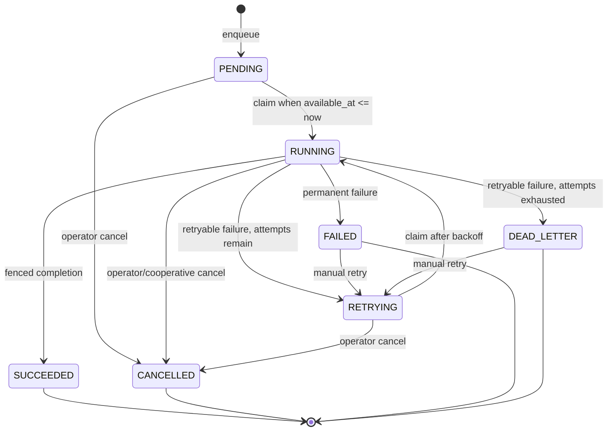

# Execution state machine

## Delivery semantics

Execution is an internal PostgreSQL-backed, at-least-once job system. A worker
claim, heartbeat, and finalization are fenced by all of:

- job ID;
- `RUNNING` status;
- worker ID;
- random lease token;
- attempt number.

These checks prevent a stale worker from committing a result after recovery or
cancellation. They do not make an external side effect exactly once. Every
handler receives a `JobExecutionContext` and must use
`context.side_effect_key(operation)` when the external system supports an
idempotency key.

## States and transitions

`PENDING` with a future `available_at` is the scheduled-job representation.
`RETRYING` is the retry-wait state. The existing public state names are retained
for compatibility.

## Attempts, retry, and dead letter

Claiming atomically increments `Job.attempt` and creates one unique
`JobAttempt(job_id, attempt_number)`. Retryable errors use exponential backoff
starting at five seconds, deterministic per-job/per-attempt jitter of plus or
minus 20%, and a hard maximum delay of 300 seconds.

Lower numeric priority values are claimed first. Migration
`f4a5b6c7d8e9_fix_execution_claim_priority_index.py` corrected the direction of
the v2 index. The measured replacement in
`b6c7d8e9f0a1_optimize_execution_claim_index.py` installs the partial
`ix_jobs_claim_v3` index matching the exact claim path:
`(queue, priority ASC, created_at ASC, id ASC)` where status is claimable.
On the 100,000-job reference workload it removed the full scan, sort, and
temporary I/O; the claim plan became a one-row index scan.

`RetryableJobError`, timeouts, and unclassified exceptions retry while the
bounded attempt budget remains. `PermanentJobError`, including an unknown
handler or invalid handler return contract, transitions directly to `FAILED`.
An exhausted retryable job transitions to `DEAD_LETTER`. Manual retry is allowed
only from `FAILED` or `DEAD_LETTER`; if the attempt budget is exhausted it grants
exactly one additional attempt.

## Cancellation and shutdown

`POST /api/v1/jobs/{job_id}/cancel` is idempotent for an already-cancelled job.
Cancellation of a running job locks the row, marks its attempt cancelled, clears
the lease, and therefore immediately fences finalization. The heartbeat task
observes that lease loss and cancels the local asynchronous handler. Detection
latency is bounded by `WORKER_HEARTBEAT_SECONDS` (five seconds by default).

Handlers should call `await context.checkpoint()` between bounded units of work.
Python cancellation cannot interrupt synchronous CPU work or reverse a remote
side effect already accepted by another system. Such handlers must isolate
blocking work and use the supplied stable side-effect idempotency key.

On process shutdown, an active job remains `RUNNING`; its lease expires and
stale recovery moves it to bounded retry/dead-letter handling. This deliberately
avoids assuming whether an interrupted external side effect occurred.

## Handler contract

Handlers accept `(JobExecutionContext, payload)` and return either `JobResult`
or a dictionary. Context includes:

- logical job ID and stable logical idempotency key;
- attempt number and stable attempt identity;
- worker and lease identity;
- correlation ID;
- timeout;
- cooperative cancellation event and checkpoint.

The worker races the handler against heartbeat ownership. Heartbeat rejection
or database failure cancels the handler and suppresses stale finalization.
Handler duration is bounded by `WORKER_HANDLER_TIMEOUT_SECONDS` (300 seconds by
default).

## Transaction ownership

- Repository mutation methods flush only.
- API service methods own commit, rollback, and refresh.
- Worker claim/recovery, heartbeat, and each terminal transition use separate,
  short database transactions.
- Handlers never receive a SQLAlchemy session from the worker.

## Authorization

Job submission requires `execution.submit`. Job cancellation and manual retry
require `execution.manage`. Job reads require `execution.read`. Lease tokens are
never exposed in API responses or logs.

An idempotency key can replay only the same job type, queue, priority, payload,
attempt budget, actor, and any explicitly supplied schedule/correlation ID.
Reusing it for different semantics returns HTTP 409 instead of leaking or
silently returning an unrelated job.
