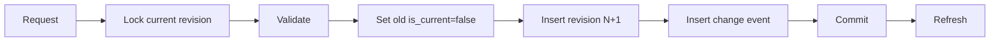

# Product Content revision architecture

## Model

Product content, SEO, landing pages, library revisions, and prompts are
append-oriented revision domains. A stable logical key identifies the history;
each immutable revision has its own UUID and increasing revision/version
number. Partial unique indexes allow at most one current or active revision for
the relevant logical scope.

Examples:

```text
ProductContent: content_key + revision
ProductSEO: seo_key + revision
LandingPage: landing_key + revision
ContentLibraryRevision: library_item_id + revision
ContentTypePromptVersion: content_type_id + version
```

## Mutation transaction

A revision command locks or reads the current row, marks it non-current, adds
the successor and its change event, flushes, then commits once. Integrity or
stale-version errors roll back the whole command. Returned rows are refreshed
after commit.

Rollback never rewrites an old row. It creates a new revision whose content is
copied from the selected historical revision, preserving an auditable forward
history.



## Read boundaries

History endpoints retain their list response shape but are bounded and use a
signed descending revision cursor. The first page records the maximum revision
as a snapshot. Later revisions cannot appear midway through that traversal.
The cursor is bound to the logical key, limit, resource, and ordering.

Large ordinary collections use offset pagination for compatibility and an
additive `pagination=cursor` mode ordered by immutable
`(created_at DESC, id DESC)`. Full product exports are explicit export
operations and are not used as ordinary list responses.

## Concurrency

Database uniqueness prevents two current revisions for one logical key.
Versioned mutable roots (library item and template) use SQLAlchemy optimistic
locking. PostgreSQL race tests must use independent sessions and barriers;
status-code-only tests are insufficient.

## Content safety

Stored source is canonical and is not assumed safe HTML. Normal preview remains
sanitized. Trusted raw preview requires both the deployment switch and the
`content.preview.raw` permission. Logs never contain content, prompts, tokens,
or full request bodies.
