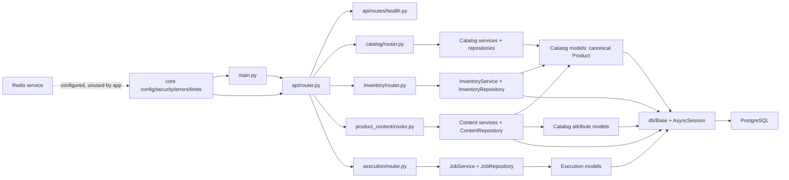
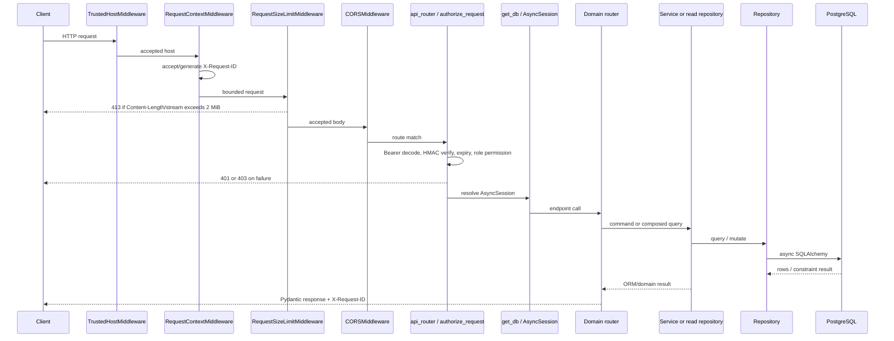
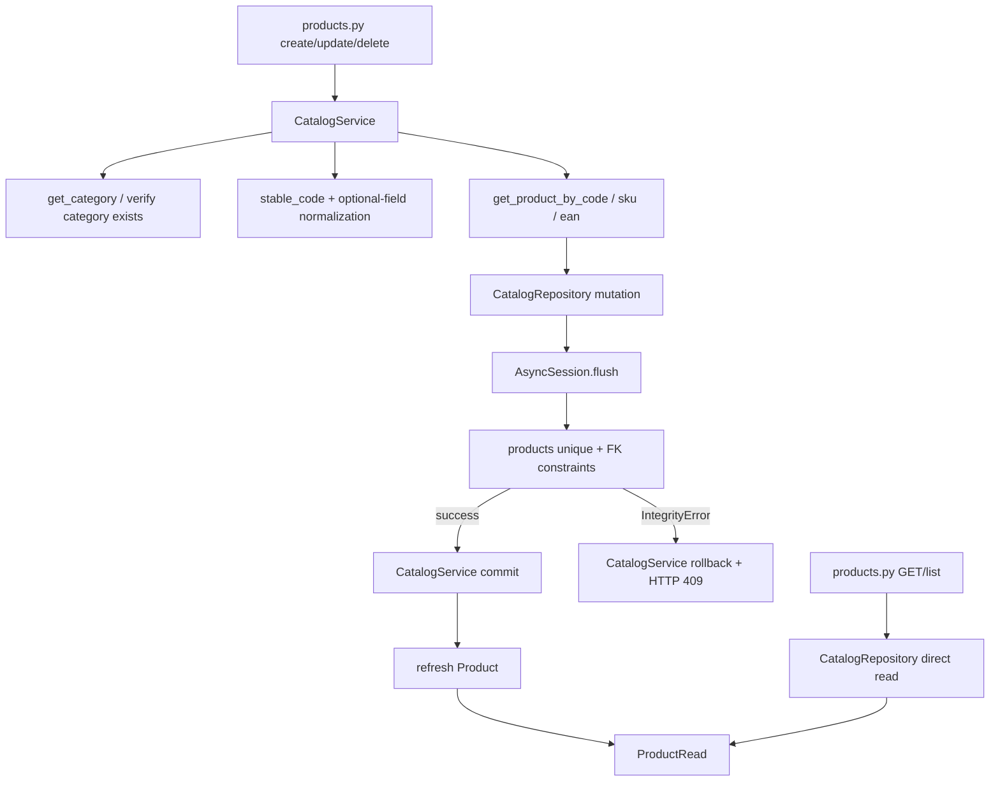
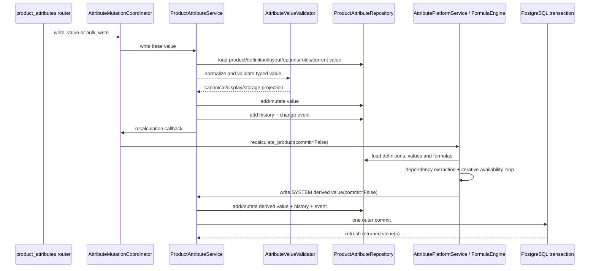
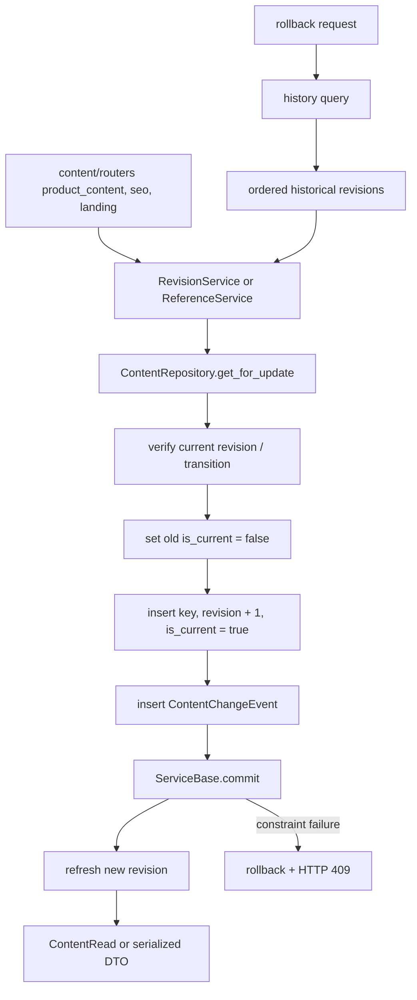
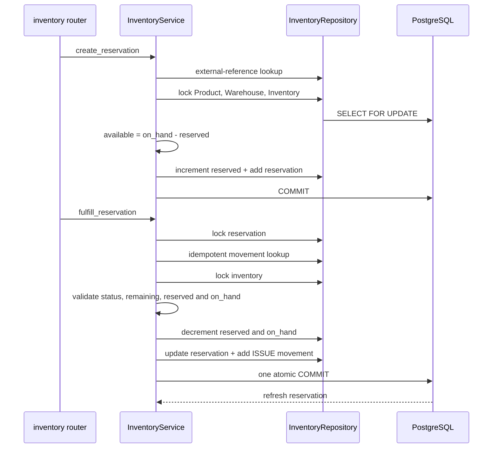
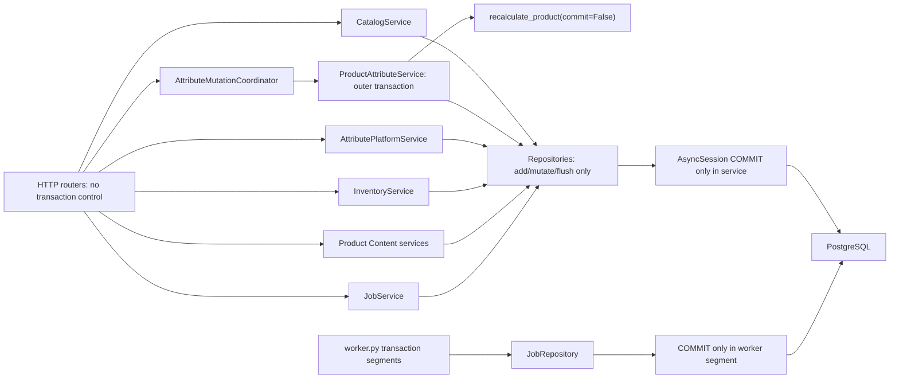
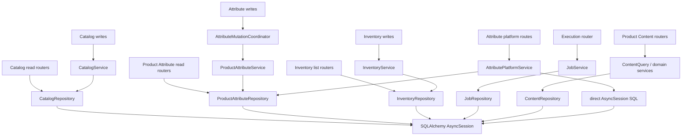
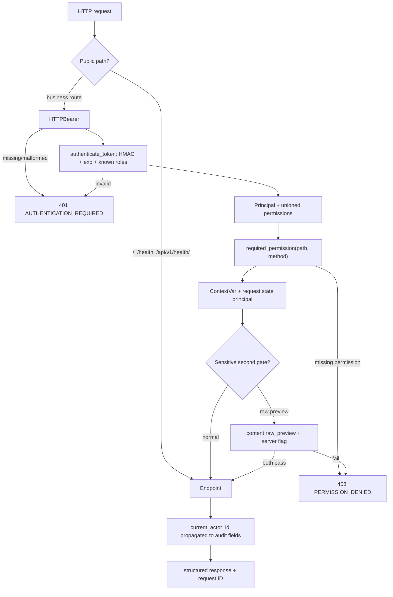

# Platform Final Pre-change Architecture Map

## Document boundary

This document freezes the architecture at entry to the **Ultimate Platform
Completion Sprint**, after the Platform Maturity audit and before any corrective
work from that sprint. It is an implementation map, not a target architecture
and not a post-change validation report.

The snapshot is based on:

- the application source under `backend/app`;
- the collected tests under `backend/tests`;
- all Alembic revisions through `f3a4b5c6d7e8`;
- `backend/pyproject.toml`, `backend/requirements.lock`,
  `backend/Dockerfile`, `.env.example`, and `docker-compose.yml`;
- generated OpenAPI and the measured results recorded in
  `docs/audits/platform-maturity-final-report.md`;
- the preceding foundation-hardening reports.

The working tree was already intentionally uncommitted at sprint entry. Its
entry inventory was 30 tracked modified files and 84 untracked files. Later
in-flight sprint edits are deliberately excluded from the architecture and
performance baseline below.

## Measured sprint-entry baseline

| Measure | Entry value |
|---|---:|
| Earlier full repository inventory | 153 files |
| Earlier full Python inventory | 121 files |
| Earlier full line inventory | approximately 21,700 lines |
| Latest measured application/test Python scope | 113 files / 20,796 lines |
| SQLAlchemy mapped tables | 46 |
| Alembic revisions | 16 |
| Alembic head/current | `f3a4b5c6d7e8` / `f3a4b5c6d7e8` |
| OpenAPI paths | 152 |
| OpenAPI operations | 223 |
| OpenAPI component schemas | 133 |
| OpenAPI security schemes | one, `BearerAuth` |
| Duplicate operation IDs | 0 |
| Normal, fixed-seed, parallel, and branch runs | 111/111 passed in each run |
| Skipped tests | 0 |
| Execution PostgreSQL race repetitions | 10/10 scenarios passed |
| Coverage | 57% of 6,764 statements and 1,022 branches |
| MyPy | 0 errors in 91 source files |
| Ruff / C901 / compilation / mappers | pass / pass / pass / pass |
| Docker | API and worker images built; API, PostgreSQL, Redis healthy; worker running |

Critical-path coverage at entry was uneven: security 90%, error handling 92%,
request middleware 81%, Product Content services 34%, Catalog
service/repository 26–27%, Inventory service/repository 20–21%, Attribute
services 13%, and Execution worker/handlers 0%.

### Entry performance evidence

The disposable reference database contained 1,000 products, 10,023 attribute
definitions, 50,000 product attribute values, 500 content revisions, 20
languages, 100 warehouses, 100,000 inventory rows, and 100,000 jobs. It was
migrated from empty to head, analyzed, benchmarked, downgrade/re-upgraded, and
removed.

| Path or query | Entry result |
|---|---:|
| Products API, 500 rows | 9.57 ms average / 45.27 ms p95 / 168 KB |
| Attributes API, 1,000 rows | 40.29 ms average / 135.59 ms p95 / 450 KB |
| Resolved attributes for one product | **421.09 ms average / 500.78 ms p95 / 12.66 MB** |
| Inventory by product, 100 rows | 4.30 ms average / 19.99 ms p95 / 37 KB |
| Jobs API, 100 rows | 26.86 ms average / 33.91 ms p95 / 55 KB |
| Content search, 100 rows | 18.28 ms average / 181.97 ms p95 / 97 KB |
| Job claim before query-index correction | 15.317 ms |
| Job claim after `f3a4b5c6d7e8` | **0.076 ms** |
| Jobs at offset 99,000 before/after index | 84.818 ms / 30.629 ms |

The 12.66 MB resolved-attribute response and the 99,100-row deep-offset walk are
the two measured entry-scale amplification paths.

## Runtime and deployment inventory

`docker-compose.yml` defines four processes:

| Process | Runtime entry point | Persistence/dependency |
|---|---|---|
| API | `uvicorn app.main:app --host 0.0.0.0 --port 8000` | async PostgreSQL; `./backend:/app` bind mount |
| Worker | `python -m app.modules.execution.worker` | async PostgreSQL; same source bind mount |
| PostgreSQL 15 | `db` service | named volume `postgres_data` |
| Redis 7 | `redis` service | named volume `redis_data` |

The API and worker share PostgreSQL but do not share process memory. Redis is
configured and deployed but no application module imports a Redis client or
uses Redis for correctness or caching. The only process-local cache is
`functools.lru_cache(maxsize=1)` around logging configuration in
`backend/app/core/logging.py`. Application lifespan in
`backend/app/main.py::lifespan` has no startup or shutdown work. Migrations are
an explicit Alembic operation and are not run by application startup.

## Module inventory and dependency direction

| Layer/module | Files and ownership |
|---|---|
| Application assembly | `backend/app/main.py`, `backend/app/api/router.py`, `backend/app/api/routes/health.py` |
| Core | `core/config.py`, `security.py`, `errors.py`, `limits.py`, `middleware.py`, `logging.py` |
| Database | `db/base.py`, `mixins.py`, `engine.py`, `session.py` |
| Catalog | canonical `Product`, categories, attribute definitions, product attributes, families, templates, formulas, prompts |
| Inventory | warehouses, balances, immutable movements/reversals, reservations and fulfillment |
| Product Content | content configuration, revisions, workflow, references, library, templates, prompts, scoring, preview and search |
| Execution | job submission, attempts, claim, lease heartbeat, retry/dead-letter and handlers |

Catalog is the canonical owner of `Product`. Inventory imports Catalog
`Product`; Product Content imports Catalog `Product`, `AttributeDefinition`, and
`ProductAttributeValue`; Execution is independent of the business modules.
Catalog imports neither Inventory nor Product Content. No function-local
application imports existed at the entry snapshot.

### Diagram 1 — module dependency graph

Exact cross-file dependency edges at entry:

| Consumer | Direct application dependencies |
|---|---|
| `app/main.py` | `api/router.py`; Core config, logging, errors and middleware |
| `app/api/router.py` | Health plus the Execution, Catalog, Inventory and Product Content aggregate routers; `authorize_request` |
| `catalog/attribute_orchestration.py` | `ProductAttributeService`, `AttributePlatformService`, value schemas/models |
| `catalog/attribute_service.py` | `ProductAttributeRepository`, `AttributeValueValidator`, Catalog models/enums/schemas |
| `catalog/platform_service.py` | `ProductAttributeRepository`, `ProductAttributeService`, `FormulaEngine`, Catalog core/attribute/platform models and schemas |
| `inventory/models.py`, `repository.py`, `service.py` | canonical `catalog/models.py::Product`; no reverse Catalog import |
| `product_content/services.py`, `completion.py`, `query_services.py` | canonical Catalog `Product`; stable-code utility |
| `product_content/repositories.py` | Catalog `AttributeDefinition` and `ProductAttributeValue` for variable projection |
| `execution/worker.py` | `AsyncSessionLocal`, `JobRepository`, `Job`, and process-local `HANDLERS` |
| `alembic/env.py` | all four domain model modules before exposing `Base.metadata` |

## Router inventory

All business routers are included below
`/api/v1` by `backend/app/api/router.py` with
`Depends(authorize_request)`. The public exceptions are `/`, `/health`, and
`/api/v1/health/`.

| Router file | Prefix / responsibility |
|---|---|
| `app/api/router.py` | root aggregator; health public; all business routers protected |
| `app/api/routes/health.py` | `/health/` API health |
| `catalog/router.py` | categories, legacy attribute definitions and category links; aggregates four Catalog child routers |
| `catalog/routers/products.py` | `/products` CRUD |
| `catalog/routers/attribute_types.py` | `/attribute-types` compatibility API over `AttributeDefinition` |
| `catalog/routers/product_attributes.py` | `/catalog` groups, definitions, assignments, options, aliases, normalization, values, approval, history, metadata, export and admin |
| `catalog/routers/attribute_platform.py` | `/catalog` families, templates, formulas, dependencies, locks, prompts, bulk update and admin |
| `inventory/router.py` | `/warehouses`, `/inventory`, movements, reversals, reservations, release/cancel/fulfill/expire |
| `execution/router.py` | `/jobs` enqueue, list and get |
| `product_content/router.py` | `/content` aggregator |
| `product_content/routers/languages.py` | language CRUD/activation |
| `product_content/routers/content_types.py` | content-type CRUD/activation and seed |
| `product_content/routers/product_content.py` | content revisions, workflow, history, rollback, diff and search |
| `product_content/routers/seo.py` | SEO revisions/history/rollback |
| `product_content/routers/landing_pages.py` | landing revisions/history/rollback |
| `product_content/routers/documents.py` | document references and link status |
| `product_content/routers/videos.py` | video references and link status |
| `product_content/routers/library.py` | library items/revisions/assignment/usage |
| `product_content/routers/templates.py` | templates, items, normalized conditions, clone, assignment and usage |
| `product_content/routers/preview.py` | preview variables and rendered preview; raw mode has a second gate |
| `product_content/routers/scoring.py` | scoring policies, content/SEO/weighted scores and history |
| `product_content/routers/prompts.py` | prompt version creation/history/activation |
| `product_content/routers/usage.py` | product/slug/campaign/source usage |
| `product_content/routers/search.py` | product export, cursor change feed and global search |
| `product_content/routers/admin.py` | HTML administration entry |

Routers do not construct SQL and do not commit, flush, or roll back. Read paths
are not uniform: several Catalog, Product Attribute, and Inventory list/get
handlers call repositories directly, while writes enter services or the
attribute coordinator.

## Service and repository inventory

### Catalog

- `catalog/service.py::CatalogService` owns category, legacy
  `AttributeDefinition`, Attribute Type façade, and Product transactions.
- `catalog/repository.py::CatalogRepository` owns the matching queries and
  flush-only mutations.
- `catalog/attribute_service.py::ProductAttributeService` owns groups,
  definitions, category assignments, options, aliases, normalization rules,
  product values, approvals, history/events and resolved layouts.
- `catalog/platform_service.py::AttributePlatformService` owns families,
  templates, formulas, dependencies, locks, usage, prompt versions and
  enterprise bulk operations.
- `catalog/attribute_orchestration.py::AttributeMutationCoordinator` explicitly
  composes base-value mutation with derived-value recalculation.
- `catalog/attribute_repository.py::ProductAttributeRepository` is the shared
  attribute query/flush repository.
- `catalog/attribute_validation.py::AttributeValueValidator` normalizes and
  validates typed values.
- `catalog/formula_engine.py::FormulaEngine` parses the restricted expression
  language, extracts dependencies, validates graphs, and evaluates expressions.

### Inventory

- `inventory/service.py::InventoryService` owns all warehouse, balance,
  movement, reversal, reservation, release, cancellation, fulfillment and
  expiry transactions.
- `inventory/repository.py::InventoryRepository` owns product/warehouse/balance
  lookup and locking, movement/reservation query, and flush-only persistence.

### Product Content

- `product_content/services.py::ServiceBase` owns the common
  commit/rollback/refresh and change-event behavior.
- `ConfigurationService`, `RevisionService`, `ReferenceService`,
  `LibraryService`, `TemplateService`, and `PromptService` own their named
  mutations.
- `product_content/query_services.py::ContentQueryService`,
  `ScoringService`, and `PreviewService` own composed reads, scoring and
  preview.
- `product_content/completion.py::ContentCompletionService` resolves product
  and attribute variables and renders template previews.
- `product_content/repositories.py::ContentRepository` owns Product Content
  SQL and flush-only primitives.

### Execution

- `execution/service.py::JobService` owns API submission transaction handling
  and read delegation.
- `execution/repository.py::JobRepository` owns idempotent creation, list,
  claim, heartbeat, lease validation, finalization, attempt completion and stale
  recovery.
- `execution/worker.py` owns claim/recovery, heartbeat and completion
  transaction scopes around handler execution.
- `execution/handlers.py::HANDLERS` is a process-local dictionary containing
  `system.health_echo` and `test`.

## ORM model inventory

There is one declarative base, `backend/app/db/base.py::Base`, with naming
conventions. The entry model graph contains 46 tables:

| Owner/file | ORM class → table |
|---|---|
| Catalog core, `catalog/models.py` | `Category` → `categories`; `AttributeDefinition` → `attribute_definitions`; `CategoryAttribute` → `category_attributes`; `Product` → `products` |
| Product Attributes, `catalog/attribute_models.py` | `AttributeGroup` → `attribute_groups`; `AttributeOption` → `attribute_options`; `AttributeOptionAlias` → `attribute_option_aliases`; `AttributeNormalizationRule` → `attribute_normalization_rules`; `ProductAttributeValue` → `product_attribute_values`; `ProductAttributeValueHistory` → `product_attribute_value_history`; `AttributeChangeEvent` → `attribute_change_events` |
| Attribute Platform, `catalog/platform_models.py` | `AttributeFamily` → `attribute_families`; `AttributeFamilyItem` → `attribute_family_items`; `AttributeTemplate` → `attribute_templates`; `AttributeTemplateItem` → `attribute_template_items`; `AttributeTemplateFamily` → `attribute_template_families`; `CategoryAttributeFamily` → `category_attribute_families`; `CategoryAttributeTemplate` → `category_attribute_templates`; `AttributeFormula` → `attribute_formulas`; `AttributeDependency` → `attribute_dependencies`; `AttributePromptVersion` → `attribute_prompt_versions` |
| Inventory, `inventory/models.py` | `Warehouse` → `warehouses`; `Inventory` → `inventory`; `InventoryMovement` → `inventory_movements`; `InventoryReservation` → `inventory_reservations` |
| Execution, `execution/models.py` | `Job` → `jobs`; `JobAttempt` → `job_attempts`; `BusinessEvent` → `business_events` |
| Product Content, `product_content/models.py` | `Language` → `content_languages`; `ContentType` → `content_types`; `ProductContent` → `product_contents`; `ProductSEO` → `product_seo`; `LandingPage` → `product_landing_pages`; `DocumentReference` → `product_document_references`; `VideoReference` → `product_video_references`; `ContentChangeEvent` → `content_change_events`; `ContentLibraryItem` → `content_library_items`; `ContentLibraryRevision` → `content_library_revisions`; `ProductLibraryReference` → `product_library_references`; `ContentTemplate` → `content_templates`; `ContentTemplateItem` → `content_template_items`; `ContentTemplateCondition` → `content_template_conditions`; `ProductContentTemplate` → `product_content_templates`; `ContentScoringPolicy` → `content_scoring_policies`; `ContentScoreHistory` → `content_score_history`; `ContentTypePromptVersion` → `content_type_prompt_versions` |

Important cross-table invariants include unique Product `code`/`sku`/`ean`,
unique active inventory per warehouse/product, nonnegative balance checks,
reserved not above on-hand, movement/reference idempotency keys, reservation
quantity/status checks, one revision number per content key, partial uniqueness
of current content/SEO/landing revisions, one attribute value identity per
product/definition/value key, and one job attempt number per job.

## Schema inventory

The public Pydantic schema layer at entry is:

| File | Schemas |
|---|---|
| `catalog/schemas/categories.py` | `CategoryCreate`, `CategoryUpdate`, `CategoryRead`, `CategoryTree`, `CategoryList` |
| `catalog/schemas/products.py` | `ProductCreate`, `ProductUpdate`, `ProductRead`, `ProductList` |
| `catalog/schemas/attributes.py` | `AttributeCreate`, `AttributeUpdate`, `AttributeRead`, `CategoryAttributeRead`, `AttributeList`, `CategoryAttributeReorderItem`, `CategoryAttributeReorder` |
| `catalog/schemas/attribute_types.py` | `AttributeTypeCreate`, `AttributeTypeUpdate`, `AttributeTypeRead`, `AttributeTypeList` |
| `catalog/schemas/product_attributes.py` | `AttributeGroupCreate/Update/Read`, `ReorderItem`, `ReorderRequest`, `AttributeDefinitionCreate/Update/Read`, `CategoryAssignmentCreate/Update/Read`, `AttributeOptionCreate/Update/Read`, `AttributeAliasCreate/Read`, `NormalizationRuleCreate/Update/Read`, `ProductAttributeValueWrite/Read`, `BulkValueItem`, `BulkValueWrite`, `ValidationResult`, `ApprovalRequest`, `ChangeEventRead`, `ResolvedAttribute`, `FilterMetadata`, `ProductExport` |
| `catalog/schemas/attribute_platform.py` | `NamedEntityCreate/Update`, `FamilyRead`, `FamilyItemCreate`, `TemplateCreate/Update/Read`, `TemplateItemCreate`, `TemplateImport`, `FormulaCreate/Update/Read`, `FormulaPreview`, `DependencyCreate/Read`, `PromptVersionCreate/Read`, `LockRequest`, `BulkProductChange`, `EnterpriseBulkWrite` |
| `inventory/schemas.py` | `WarehouseCreate/Update/Read/List`, `InventoryCreate/Update/Read/List`, `InventoryMovementCreate/Read/List`, `InventoryReservationCreate/Read/List/Fulfill`, `ReservationReleaseResponse`, `ReservationCancelResponse`, `ReservationExpireSummary` |
| `execution/schemas.py` | `JobCreate`, `JobRead`, `JobList`, `BusinessEventRead` |
| `product_content/schemas.py` | `LanguageCreate/Update/Read`, `ContentTypeCreate/Update/Read`, `ContentWrite/Read`, `WorkflowRequest`, `SEOWrite`, `LandingWrite`, `ReferenceWrite`, `LinkCheckWrite`, `RollbackRequest`, `LibraryWrite/Update`, `TemplateWrite/Update`, `TemplateItemWrite`, `TemplateConditionWrite`, `PreviewRequest`, `ScoringPolicyWrite`, `PromptWrite` |

`ORMModel` is a module-local Pydantic base name repeated in
`catalog/schemas/product_attributes.py`,
`catalog/schemas/attribute_platform.py`, and
`product_content/schemas.py`; it is a helper, not a shared domain schema.
`catalog/schemas/__init__.py` re-exports the original Catalog CRUD contracts.

## Alembic migration chain

The migration graph is one linear chain:

`cea65f170298` → `8b2f4d1c6a10` → `d4a9c8e7f621` →
`eb5f2829e72e` → `f1a2b3c4d5e6` → `b2c3d4e5f6a7` →
`c3d4e5f6a7b8` → `d5e6f7a8b9c0` → `e6f7a8b9c0d1` →
`f7a8b9c0d1e2` → `a8b9c0d1e2f3` → `b9c0d1e2f3a4` →
`c0d1e2f3a4b5` → `d1e2f3a4b5c6` → `e2f3a4b5c6d7` →
`f3a4b5c6d7e8`.

| Revision | Schema responsibility |
|---|---|
| `cea65f170298` | baseline revision |
| `8b2f4d1c6a10` | jobs, job attempts and business events |
| `d4a9c8e7f621` | categories, attribute definitions, category-attribute links and seed foundation |
| `eb5f2829e72e` | canonical products table |
| `f1a2b3c4d5e6` | warehouses and inventory balances |
| `b2c3d4e5f6a7` | inventory movements and reversal fields |
| `c3d4e5f6a7b8` | inventory reservations |
| `d5e6f7a8b9c0` | Product Attribute columns, groups, options, aliases, normalization, values, history and events |
| `e6f7a8b9c0d1` | families, templates, formulas, dependencies, prompts and value locking |
| `f7a8b9c0d1e2` | Product Content languages/types/revisions, SEO, landing, references and events |
| `a8b9c0d1e2f3` | Content library, templates, scoring, prompts and scheduling/link fields |
| `b9c0d1e2f3a4` | normalized content-template conditions |
| `c0d1e2f3a4b5` | Product Content quality constraints and indexes |
| `d1e2f3a4b5c6` | current-revision and scheduling invariants |
| `e2f3a4b5c6d7` | execution job lease token |
| `f3a4b5c6d7e8` | execution claim and stable-list indexes |

`backend/alembic/env.py` imports the four model modules before assigning
`Base.metadata`; `catalog/models.py` re-exports Attribute and Platform model
classes so mapper/Alembic discovery remains compatible.

One entry mismatch is visible in this chain: `JobRepository.claim_next` orders
by `(priority ASC, created_at ASC, id ASC)` (lower numeric priority wins), while
`f3a4b5c6d7e8` and the entry ORM declaration define `ix_jobs_claim_v2` with
`priority DESC`. The recorded 0.076 ms sample does not make those definitions
equivalent; correcting the direction requires a new child revision, not an edit
to `f3a4b5c6d7e8`. The older `ix_jobs_claim` also coexists with v2 at entry.

## General API request flow

Starlette wraps middleware in reverse registration order. The effective outer
path is Trusted Host → request context → request-size limit → CORS → routing.
FastAPI then resolves the router-level authorization dependency and endpoint
database dependency. HTTP and validation exceptions are normalized by
`core/errors.py`.

### Diagram 2 — API request flow

## Product mutation flow

Exact command call chains are:

- Create: `catalog/routers/products.py::create_product` →
  `CatalogService.create_product` → category existence, normalization and
  uniqueness checks → `CatalogRepository.create_product` → `flush` →
  service `commit` → `refresh`.
- Update: `update_product` → `CatalogService.update_product` → Product/category
  lookup, normalization, `sku`/`ean` checks, real-change version increment →
  `CatalogRepository.update_product` → `flush` → service `commit` → `refresh`.
- Delete: `deactivate_product` → `CatalogService.deactivate_product` →
  `CatalogRepository.deactivate_product` sets `is_active=False` and increments
  version → `flush` → service `commit` → `refresh`.
- Read/list: the router calls `CatalogRepository.get_product/list_products`
  directly. Entry list pagination is offset-based and ordered by
  `(Product.name ASC, Product.id ASC)`.

Database uniqueness remains the race-safe boundary after service prechecks.
Catalog never writes inventory quantities as part of Product mutation.

### Diagram 3 — Product mutation flow

## Attribute mutation and recalculation flow

The explicit base-write path is:

`catalog/routers/product_attributes.py::write_value` →
`AttributeMutationCoordinator.write_value` →
`ProductAttributeService.write_value` →
`validate_value`/`AttributeValueValidator.normalize` →
`ProductAttributeRepository.value`, `mutate` or `add` →
`ProductAttributeValueHistory` + `AttributeChangeEvent` →
injected `AttributeMutationCoordinator._recalculate` →
`AttributePlatformService.recalculate_product(commit=False)` →
`FormulaEngine.dependencies/evaluate` →
`ProductAttributeService.write_value(commit=False, source=SYSTEM)` for derived
values → outer `ProductAttributeService._commit`.

The `SYSTEM` source check prevents derived writes from recursively invoking
recalculation. Bulk writes call the same value writer with `commit=False` for
each item and commit once after all items succeed. Approval/rejection and value
deactivation also write history/event rows in the same service transaction.

At entry, resolved reads were unbounded:

- `GET /api/v1/catalog/categories/{category_id}/attributes/resolved` →
  `resolved_category_layout` → `ProductAttributeService.resolved_layout`.
- `GET /api/v1/catalog/products/{product_id}/attributes` →
  Product lookup → `resolved_layout(product.category_id, product=product)`.
- `GET /api/v1/catalog/products/{product_id}/export` embedded that same resolved
  list in `ProductExport`.

`resolved_layout` walked category ancestry through
`ProductAttributeRepository.list_category_chain`, loaded active category
assignments, loaded **all active AttributeDefinition rows**, selected
GLOBAL/SYSTEM and category winners in Python, loaded all active values for the
product, created a full `AttributeDefinitionRead` inside every
`ResolvedAttribute`, loaded groups, sorted in Python, and returned a list
without a limit. This is the exact source of the measured 10,023-definition,
12.66 MB response.

### Diagram 4 — Attribute mutation and recalculation flow

## Product Content revision flow

Exact content revision chain:

`product_content/routers/product_content.py::revise_content` →
`RevisionService.revise_content` →
`ServiceBase.required_for_update` →
`ContentRepository.get_for_update(ProductContent, id)` →
`SELECT ... FOR UPDATE` →
validate `is_current` →
`RevisionService._build_revision` marks the current row false and creates the
next revision with `revision + 1` and SHA-256 content hash →
`ContentRepository.add` for the revision and `ContentChangeEvent` →
`ServiceBase.commit` → refresh.

Workflow transitions use the same revision-building path and record the
authenticated actor, approval/publish timestamps, and a second event.
Rollback reads a historical revision then invokes `revise_content`; historical
rows are not overwritten. SEO and Landing revisions use
`ReferenceService.revise_seo/revise_landing`, with history and rollback via the
same repository primitives. Database partial unique indexes enforce one current
revision per logical key.

### Diagram 5 — Content revision flow

## Inventory reservation and fulfillment flow

Reservation creation:

`inventory/router.py::create_reservation` →
`InventoryService.create_reservation` → external-reference idempotency lookup →
lock active Product → lock Warehouse(s) in sorted UUID order →
`InventoryRepository.get_inventory_for_update` →
validate active balance and `quantity_available` →
increment `quantity_reserved` and version →
insert `InventoryReservation` →
one service commit and refresh. An `IntegrityError` rolls back and re-reads the
external reference to distinguish an idempotent retry from a conflict.

Fulfillment:

`fulfill_reservation` router → `InventoryService.fulfill_reservation` →
lock reservation → check idempotent movement external reference → validate
state and remaining quantity → lock balance → atomically decrement
`quantity_reserved` and `quantity_on_hand`, increment balance/reservation
versions, advance reservation to `PARTIALLY_FULFILLED` or `FULFILLED`, and
insert an `ISSUE` movement → one commit and refresh. Release/cancel lock the
reservation and balance and release only the remaining reserved quantity.
Expiry uses ordered `FOR UPDATE SKIP LOCKED` batches.

### Diagram 6 — Inventory reservation and fulfillment flow

## Execution job lifecycle

At entry the enum declared `PENDING`, `RUNNING`, `SUCCEEDED`, `FAILED`,
`RETRYING`, `CANCELLED`, and `DEAD_LETTER`, but only these transitions were
implemented:

- enqueue → `PENDING`;
- `PENDING` or `RETRYING` → `RUNNING` through an ordered
  `FOR UPDATE SKIP LOCKED` claim;
- `RUNNING` → `SUCCEEDED`;
- `RUNNING` → `RETRYING` while attempts remain;
- `RUNNING` → `DEAD_LETTER` at maximum attempts;
- stale `RUNNING` → the same retry/dead-letter failure path.

`FAILED` and `CANCELLED` had no reachable service/router transition.

Exact asynchronous chain:

`execution/router.py::enqueue_job` → `JobService.enqueue` →
`JobRepository.create` → service commit/rollback/refresh. Worker
`process_once` creates an independent session, calls `recover_stale` and
`claim_next`, commits the claim, executes the handler outside that transaction,
runs `heartbeat_lease` in separate sessions, then calls `complete_job` or
`fail_job` in a new locking session. Claim sets `locked_by`, `locked_at`, a
random lease token, increments attempt/version and inserts `JobAttempt`.
Heartbeat and finalization compare job ID, `RUNNING`, worker ID, lease token,
and attempt. Stale workers therefore cannot finalize newer attempts.

The entry semantics were at-least-once with fenced database finalization. There
was no handler protocol/context, timeout, cooperative cancellation, jitter,
retry classification, or external-side-effect idempotency context. Lease loss
in the background heartbeat did not interrupt a handler already running.

### Diagram 7 — Execution job lifecycle

```mermaid
stateDiagram-v2
    [*] --> PENDING: enqueue + commit
    PENDING --> RUNNING: claim_next / lease + attempt
    RETRYING --> RUNNING: available_at reached
    RUNNING --> SUCCEEDED: fenced successful finalization
    RUNNING --> RETRYING: failure or stale recovery; attempts remain
    RUNNING --> DEAD_LETTER: failure or stale recovery; max attempts reached
    SUCCEEDED --> [*]
    DEAD_LETTER --> [*]

    state "Declared but unreachable" as U {
        FAILED
        CANCELLED
    }
```

## Transaction ownership

Repositories mutate and flush only. HTTP routers do not own transactions.
Services own request transactions; worker functions own worker transaction
segments.

| Transaction domain | Owner | Commit boundary |
|---|---|---|
| Category, legacy Attribute, Attribute Type façade, Product | `CatalogService` | each command |
| Attribute group/definition/assignment/option/rule | `ProductAttributeService._commit` | each command |
| Base value + history/event + derived recalculation | `ProductAttributeService`, entered through `AttributeMutationCoordinator` | one outer value or bulk command |
| Family/template/formula/dependency/lock/prompt | `AttributePlatformService._commit` | each platform command; template import and bulk use explicit aggregate commits |
| Warehouse, balance, movement, reservation | `InventoryService` | one business command; balance/history rows remain atomic |
| Product Content configuration/revision/reference/library/template/prompt/scoring | `ServiceBase` subclasses | one command plus event/history |
| API job enqueue | `JobService.enqueue` | one submission |
| Worker stale recovery + claim | `worker.process_once` | before handler execution |
| Worker heartbeat | `worker.heartbeat_lease` | one independent heartbeat |
| Worker success/failure | `worker.complete_job` / `worker.fail_job` | one fenced finalization |

### Diagram 8 — transaction ownership graph

## Repository and query ownership

The intended direction is router → service/coordinator → repository →
SQLAlchemy. The entry implementation intentionally allows router → repository
for simple reads. `AttributePlatformService` is the principal exception to
strict query ownership because it executes a substantial set of SQLAlchemy
queries directly.

| Query owner | Query surface |
|---|---|
| `CatalogRepository` | `get_category`, `get_category_by_code`, `list_categories`, `list_all_categories`, category mutations; `get_attribute`, `get_attribute_by_code`, `list_attributes`, attribute mutations; Attribute Type aliases; link/link-all/global-link/category-link queries; `list_category_attributes`, `get_category_attribute`; Product list/get/code/sku/ean and mutations |
| `ProductAttributeRepository` | generic get/add/mutate; groups; definitions/identity; category chain; assignments; options/aliases/rules; product values; histories/change feed/latest cursor; dashboard/count; formula/dependency/prompt lists |
| `InventoryRepository` | Product and Warehouse normal/locking reads; warehouse list/mutations; balance normal/pair/locking/list/mutations; movement normal/locking/idempotency/list/add/reversal; reservation normal/locking/idempotency/list/expiry-batch/add/flush |
| `JobRepository` | create/idempotency/get/locking get/list; ordered claim; heartbeat compare-and-update; lease validation; success/failure/attempt finalization; stale recovery |
| `ContentRepository` | generic get/locking get/add/delete/flush; language/type queries; content search/current/history/duplicate; generic references and revision queries; product export/change feed; library revision/usage; templates/items/conditions/render rows/usage; Product Attribute variable projection; scores/policies; prompts; global search |
| `AttributePlatformService` direct SQL | family/template association and usage counts; inheritance traversal; formula graph/formula list for recalculation; dependency validation; locks; aggregate usage; prompt activation; enterprise bulk |

Stable tie-break ordering existed on normal high-volume offset lists, including
Product `(name,id)`, Inventory `(updated_at DESC,id DESC)`, movements
`(occurred_at DESC,id DESC)`, reservations `(created_at DESC,id DESC)`, jobs
`(created_at DESC,id DESC)`, and claims
`(priority ASC,created_at ASC,id ASC)`. The ordering was deterministic, but
offset pagination remained linear.

### Diagram 9 — repository query ownership

## Security and authorization boundaries

`backend/app/core/security.py` issues and verifies a two-part, URL-safe token:
sorted JSON payload plus HMAC-SHA256 signature. Payload fields are `sub`,
`roles`, `type`, `iat`, and `exp`. Authentication validates signature, expiry,
subject and known roles; permissions are the union of role permissions.
`Principal` is placed in both a request `ContextVar` and
`request.state.principal`. Domain services call `current_actor_id()` so audit
actors cannot normally be spoofed by request payload.

Authorization is a central path/method policy:

| Route family | Read | Ordinary write | Elevated write |
|---|---|---|---|
| Catalog Products/Categories | `catalog.read` | `catalog.write` | seed uses `catalog.seed` |
| Attributes and `/catalog` | `attributes.read` | `attributes.write` | approve/reject/lock use `attributes.approve` |
| Product Content | `content.read` | `content.write` | workflow/approve, prompts, scoring and raw preview have dedicated permissions |
| Inventory/Warehouse | `inventory.read` | `inventory.write` | movements/reservations use `inventory.adjust` |
| Execution jobs | `execution.read` | POST uses `execution.submit` | `execution.manage` exists but no management route consumed it |

Raw preview has two additional conditions:
`preview.py` calls `require_current_permission(CONTENT_RAW_PREVIEW)` when the
payload requests trusted raw mode, and
`ContentCompletionService` checks
`settings.product_content_trusted_raw_preview`. Production settings reject that
server flag.

### Diagram 10 — security and authorization flow

Entry limitations were explicit: one shared HMAC key, no issuer/audience/key ID,
no active/previous key rotation, no JTI/revocation, no token issuance endpoint,
no object/tenant policy, and no application rate limiting.

## Compatibility façades and overlapping contracts

These files are active compatibility surfaces and must not be deleted merely
because a newer implementation exists:

| Façade | Exact behavior |
|---|---|
| `catalog/routers/attribute_types.py` | public Attribute Type API façade over `AttributeDefinition`; there is no `AttributeType` ORM model/table |
| `CatalogRepository.get/list/create/update/deactivate_attribute_type` | aliases or thin mutations over the canonical AttributeDefinition query/persistence logic |
| `CatalogService` Attribute Type methods | translate `AttributeType*` schemas into canonical `AttributeDefinition` rows |
| `catalog/models.py` bottom imports | re-export `attribute_models.py` and `platform_models.py` classes for established mapper/import discovery |
| `catalog/schemas/__init__.py` | re-exports original Category/Attribute/Attribute Type/Product contracts |
| `product_content/service.py::ProductContentService` | backward-compatible multiple-inheritance façade over `ConfigurationService`, `RevisionService`, and `ReferenceService`; delegates scoring |
| `product_content/repository.py::ProductContentRepository` | compatibility subclass/name over canonical `ContentRepository`; aliases `history` |
| `product_content/router.py` | stable `/content` aggregator over responsibility routers |

Catalog also exposes two schema vocabularies over the same
`attribute_definitions` table: legacy `AttributeCreate/Read` and richer
`AttributeDefinitionCreate/Read`. They are not separate entities. The canonical
Product appears only in `catalog/models.py`; Inventory and Product Content hold
foreign keys and imports, not duplicate Product models.

## Query, response, bulk, history and cache map

### Ordinary bounded query paths

- Catalog Category, Product, Attribute and Attribute Type lists use bounded
  offset/limit and stable ID tie-breakers.
- Inventory Warehouse, balance, movement and reservation lists use bounded
  offset/limit and stable ID tie-breakers.
- Execution job list uses bounded offset/limit and stable descending
  `(created_at,id)`.
- Product Content entry/global searches use bounded offset/limit; change feeds
  use monotonic integer cursors.
- Worker claim and reservation expiry use ordered
  `FOR UPDATE SKIP LOCKED`.

### Entry large or unbounded response paths

- Product/category resolved attributes and Product export materialize all
  applicable global definitions; this is the measured 12.66 MB defect.
- Category filter and compatibility metadata derive from the same resolved
  layout and can inherit its definition/option fan-out.
- Product Content product export aggregates all current content, SEO, landing,
  document and video rows into one in-memory dictionary.
- Product Content histories, reference lists, template details/usage, prompt
  histories, scoring histories and several configuration/reference lists have
  no page contract.
- Attribute histories, some platform family/template/formula/dependency/prompt
  lists, template export and usage aggregates have no uniform page contract.
- JSON response payloads contain full stored job payload/result, content source
  metadata, attribute definitions/options and template metadata where their
  schemas request them.

### Bulk paths

- `seed_global_attributes` and Content `seed` create canonical reference data.
- Catalog category-attribute reorder and Product Attribute group/definition/
  assignment reorder flush multiple rows then commit once.
- Product Attribute `bulk_write` and validation loop across a bounded request
  payload; writes share one transaction.
- Attribute Platform template import/clone, Product assignment,
  recalculation, bulk preview and bulk commit compose multiple rows.
- Product Content template items/conditions, clone and assignment compose
  library/template relations.
- Inventory reservation expiry processes a caller-bounded, locked batch.
- Execution stale recovery selects all qualifying stale jobs without an
  explicit batch limit at entry.

### Revision and history paths

| Domain | Revision/history mechanism |
|---|---|
| Catalog core | `version` plus soft delete; no Product/Category history table |
| Product Attributes | `ProductAttributeValueHistory` and monotonic `AttributeChangeEvent`; value `version` |
| Attribute Platform | template/prompt version fields; `AttributePromptVersion`; no general family/formula history |
| Inventory | balance/reservation versions; immutable movement rows and explicit reversal link; no Warehouse/Inventory history table |
| Product Content | immutable Content/SEO/Landing/Library revisions, current-row flags, `ContentChangeEvent`, score history and prompt versions |
| Execution | Job state/version, one `JobAttempt` per attempt, Business Event rows |

### Cache use

There is no domain cache, query cache, resolved-layout cache or Redis-backed
cache. All canonical reads go to PostgreSQL. The platform is therefore correct
without Redis, but every repeated resolved-layout or definition read incurs the
full database/Python/serialization cost.

## Test and architecture enforcement inventory

Collected tests at entry cover:

- Catalog CRUD, unit and transaction behavior;
- Product Attribute core and platform completion;
- Inventory CRUD, movements, reservations and transaction rollback;
- Execution unit and real-PostgreSQL idempotency/fencing races;
- Product Content platform, completion, boundaries, quality, OpenAPI and
  PostgreSQL revision races;
- health, security foundation, module boundaries and static MyPy baseline.

`backend/tests/test_module_boundaries.py` enforces:

- Catalog must not import Inventory;
- no module-file/package name collision;
- active routers and mappers import;
- repositories and routers do not commit;
- routers do not construct SQL or execute/flush/commit/rollback a session;
- repositories import no FastAPI and own no commit/rollback;
- every non-public route has `authorize_request`;
- no hidden local Attribute service import cycle;
- Product mutation remains independent of Inventory.

At entry, these tests proved structural direction but did not yet prove every
cross-domain race, failure/restart point, worker lifecycle state, request-field
boundary, response-size budget or cursor invariant required by the completion
sprint.

## Exact pre-change hotspots

The latest measured class inventory was:

| Class | LOC | Public/all methods | Responsibilities present at entry |
|---|---:|---:|---|
| `InventoryService` | 1,040 | 17/38 | warehouses, balances, movements, reversal, reservations, fulfillment, expiry |
| `AttributePlatformService` | 892 | 36/43 | families, templates, formulas, dependencies, locks, prompts, usage, bulk |
| `ProductAttributeService` | 822 | 27/36 | definition administration, normalization, values, history, approval, layout |
| `CatalogService` | 725 | 15/22 | categories, legacy attributes, type façade, products |
| `ContentRepository` | 619 | 45/46 | all Product Content query domains |
| `CatalogRepository` | 462 | 32/33 | all core Catalog query domains |
| `InventoryRepository` | 423 | 31/32 | all Inventory query and lock domains |
| `ProductAttributeRepository` | 371 | 24/25 | all Product Attribute and selected Platform queries |

These are the precise decomposition inputs. Compatibility façades, transaction
boundaries, canonical Product ownership, public routes, operation IDs, request
schemas and response schemas form the preservation boundary for subsequent
work.
